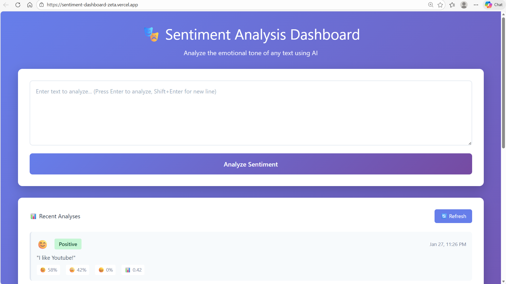
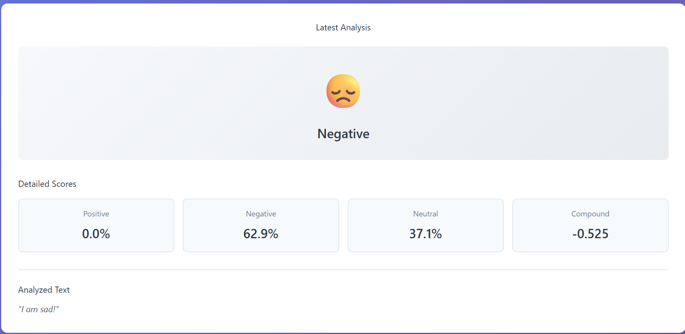

# 🎭 Sentiment Analysis Dashboard

A full-stack web application for real-time sentiment analysis using AI. Analyze the emotional tone of any text instantly with VADER sentiment analysis, featuring a beautiful React interface and robust FastAPI backend.

🔗 **Live Demo:** [https://sentiment-dashboard-zeta.vercel.app/](https://sentiment-dashboard-zeta.vercel.app/)  
📚 **API Docs:** [https://sentiment-dashboard-api.onrender.com/docs](https://sentiment-dashboard-api.onrender.com/docs)  
💻 **GitHub:** [https://github.com/Vv243/sentiment-dashboard](https://github.com/Vv243/sentiment-dashboard)

---

## ✨ Features

### Current (v1.0)

- ✅ **Real-time sentiment analysis** using VADER AI
- ✅ **Beautiful gradient UI** with responsive design
- ✅ **RESTful API** with FastAPI
- ✅ **Detailed sentiment scores** (positive, negative, neutral, compound)
- ✅ **Emoji indicators** for quick sentiment recognition
- ✅ **Production deployment** on Vercel + Render
- ✅ **Interactive API documentation** with Swagger UI

### Planned (v2.0)

- 🔄 Social media integration (Reddit, Twitter)
- 🔄 Stock/cryptocurrency sentiment tracking
- 🔄 Historical data analysis with charts
- 🔄 Real-time sentiment trends
- 🔄 Bulk text analysis
- 🔄 Export data to CSV

---

## 🛠️ Tech Stack

### Frontend

- **React 18** - Modern UI library
- **Vite** - Fast build tool
- **CSS3** - Custom gradient styling
- **Deployed on Vercel** - Edge CDN delivery

### Backend

- **FastAPI** - High-performance Python API framework
- **Python 3.11** - Modern Python features
- **VADER Sentiment** - AI-powered sentiment analysis
- **Motor** - Async MongoDB driver
- **Deployed on Render** - Cloud platform

### Database

- **MongoDB Atlas** - Cloud NoSQL database (configured)

### DevOps

- **Git/GitHub** - Version control
- **Vercel** - Frontend hosting
- **Render** - Backend hosting
- **Environment variables** - Secure configuration

---

## 🚀 Quick Start

### Prerequisites

- Python 3.11+
- Node.js 18+
- Git

### Local Development

#### 1. Clone Repository

```bash
git clone https://github.com/Vv243/sentiment-dashboard.git
cd sentiment-dashboard
```

#### 2. Backend Setup

```bash
cd backend

# Create virtual environment
python -m venv venv

# Activate virtual environment
# Windows:
venv\Scripts\activate
# Mac/Linux:
source venv/bin/activate

# Install dependencies
pip install -r requirements.txt

# Create .env file
# Add your MongoDB URL (optional for basic functionality)

# Start server
uvicorn app.main:app --reload
```

Backend runs on **http://localhost:8000**

#### 3. Frontend Setup

```bash
cd frontend

# Install dependencies
npm install

# Create .env file
echo "VITE_API_URL=http://localhost:8000" > .env

# Start development server
npm run dev
```

Frontend runs on **http://localhost:3000**

---

## 📖 API Documentation

Interactive API documentation available at:

- **Local:** http://localhost:8000/docs
- **Production:** https://sentiment-dashboard-api.onrender.com/docs

### Main Endpoints

#### `POST /api/v1/sentiment/analyze`

Analyze sentiment of input text

**Request:**

```json
{
  "text": "I love this product! It's amazing!"
}
```

**Response:**

```json
{
  "text": "I love this product! It's amazing!",
  "sentiment": "positive",
  "emoji": "😊",
  "scores": {
    "positive": 0.682,
    "negative": 0.0,
    "neutral": 0.318,
    "compound": 0.8225
  },
  "timestamp": "2026-01-26T18:30:00",
  "saved_to_db": true
}
```

#### `GET /api/v1/sentiment/history?limit=10`

Retrieve recent sentiment analyses

**Response:**

```json
{
  "count": 10,
  "limit": 10,
  "analyses": [...]
}
```

---

## 📁 Project Structure

```
sentiment-dashboard/
├── backend/              # FastAPI backend
│   ├── app/
│   │   ├── api/         # API endpoints
│   │   │   └── sentiment.py
│   │   ├── core/        # Configuration
│   │   │   └── config.py
│   │   ├── models/      # Data models
│   │   │   └── schemas.py
│   │   ├── services/    # Business logic
│   │   │   └── sentiment_analyzer.py
│   │   ├── database.py  # MongoDB connection
│   │   └── main.py      # FastAPI app
│   ├── requirements.txt
│   ├── start.sh         # Render startup script
│   └── .env             # Environment variables
│
├── frontend/            # React frontend
│   ├── src/
│   │   ├── App.jsx      # Main component
│   │   ├── App.css      # Styling
│   │   └── main.jsx     # Entry point
│   ├── package.json
│   └── .env             # API URL configuration
│
├── .gitignore
└── README.md
```

---

## 🎨 Screenshots

### Main Dashboard


_Beautiful gradient UI with real-time sentiment analysis_

### Analysis Results


_Detailed scores with emoji indicators_

---

## 🌐 Deployment

### Frontend (Vercel)

```bash
# Automatic deployment on push to main branch
# Environment variables configured in Vercel dashboard
VITE_API_URL=https://sentiment-dashboard-api.onrender.com
```

### Backend (Render)

```bash
# Automatic deployment on push to main branch
# Environment variables configured in Render dashboard
MONGODB_URL=<your-mongodb-connection-string>
DATABASE_NAME=sentiment_db
```

---

## 🔧 Development Roadmap

### Phase 1: Core Features (✅ Complete)

- [x] FastAPI backend setup
- [x] VADER sentiment analysis integration
- [x] React frontend with Vite
- [x] RESTful API design
- [x] MongoDB integration (configured)
- [x] Production deployment

### Phase 2: Enhancements (🔄 In Progress)

- [ ] Social media API integration (Reddit/Twitter)
- [ ] Stock/crypto ticker sentiment tracking
- [ ] Historical data visualization
- [ ] Charts and trends
- [ ] Bulk analysis feature
- [ ] Data export (CSV/JSON)

### Phase 3: Advanced Features (📋 Planned)

- [ ] User authentication
- [ ] Custom sentiment models
- [ ] Real-time WebSocket updates
- [ ] Multi-language support
- [ ] Sentiment comparison tool
- [ ] API rate limiting

---

## 🧪 Testing

### Test the Live App

1. Visit: https://sentiment-dashboard-zeta.vercel.app/
2. Enter text like: "I absolutely love this! Best experience ever!"
3. Click "Analyze Sentiment"
4. View detailed results with emoji and scores

### Test the API

```bash
curl -X POST "https://sentiment-dashboard-api.onrender.com/api/v1/sentiment/analyze" \
  -H "Content-Type: application/json" \
  -d '{"text": "This is amazing!"}'
```

---

## 📚 Learning Outcomes

This project demonstrates:

- ✅ Full-stack development (React + FastAPI)
- ✅ RESTful API design and implementation
- ✅ Cloud deployment (Vercel + Render)
- ✅ Database integration (MongoDB Atlas)
- ✅ AI/ML integration (VADER sentiment analysis)
- ✅ Modern JavaScript (React Hooks, async/await)
- ✅ Python async programming
- ✅ Environment variable management
- ✅ CORS configuration
- ✅ Git version control

---

## 🤝 Contributing

This is a personal portfolio project, but suggestions are welcome!

1. Fork the repository
2. Create a feature branch (`git checkout -b feature/AmazingFeature`)
3. Commit changes (`git commit -m 'Add AmazingFeature'`)
4. Push to branch (`git push origin feature/AmazingFeature`)
5. Open a Pull Request

---

## 📝 License

MIT License - feel free to use this project for learning!

---

## 👤 Author

**Vinh** - [GitHub Profile](https://github.com/Vv243)

---

## 🙏 Acknowledgments

- **VADER Sentiment Analysis** - NLTK community
- **FastAPI** - Sebastián Ramírez
- **React** - Meta/Facebook
- **Vercel & Render** - Deployment platforms

---

## 📧 Contact

For questions or opportunities:

- GitHub: [@Vv243](https://github.com/Vv243)
- Project Link: [https://github.com/Vv243/sentiment-dashboard](https://github.com/Vv243/sentiment-dashboard)

---

**⭐ Star this repo if you find it useful!**
